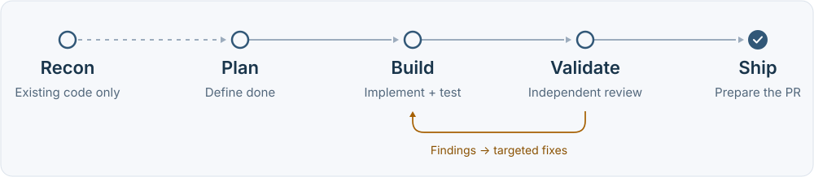

<h1 align="center">SpecShip</h1>

<p align="center">
  <strong>From specification to reviewed code.</strong><br>
  An autonomous engineering harness for <a href="https://kiro.dev">Kiro</a>.
</p>

<p align="center">
  <a href="#quick-start">Quick start</a> ·
  <a href="#how-it-works">How it works</a> ·
  <a href="#documentation">Documentation</a> ·
  <a href="#contributing">Contributing</a>
</p>

SpecShip gives coding agents a repeatable workflow: define acceptance criteria,
build in bounded tasks, run tests, and request independent reviews before
preparing a pull request. For existing codebases, it starts by mapping the behavior
your change needs to preserve.

<p align="center">
  <picture>
    <source media="(max-width: 600px)" srcset="docs/readme-workflow-mobile.svg">
    
  </picture>
</p>

## Quick start

### 1. Set up Kiro

You need **Kiro, Git, Bash, and Node.js 22.12+ with npm**. SpecShip uses two
companion skill sets:

- **[superpowers](https://github.com/obra/superpowers)** for planning, task execution, TDD, and debugging.
- **[gstack](https://github.com/garrytan/gstack)** for code, security, and browser reviews.

Follow the [companion setup guide](PREREQUISITES.md) first. UI validation also
needs Playwright MCP and a working Lighthouse or Chrome DevTools setup.

### 2. Install SpecShip

With the companion skills installed:

```bash
git clone https://github.com/aws-samples/sample-specship.git
cd sample-specship
./install.sh
```

The default installs steering globally into `~/.kiro/steering/`. The installer
checks companion skills and configures the pinned browser MCP servers when
setup is needed. Read its output for any remaining setup steps.

<details>
<summary><strong>Fresh installation, project scope, and CLI setup</strong></summary>

**Let the installer fetch missing companions.** Choose reviewed commit SHAs from
the superpowers and gstack repositories, then supply them explicitly:

```bash
# Replace these values with the full commit SHAs you reviewed.
export SPECSHIP_SUPERPOWERS_REF="YOUR_REVIEWED_SUPERPOWERS_SHA"
export SPECSHIP_GSTACK_REF="YOUR_REVIEWED_GSTACK_SHA"
./install.sh
```

Missing companions are not fetched from an unpinned revision by default. gstack's
setup script runs only with explicit opt-in. See `./install.sh --help` and the
[installation security notes](SECURITY.md) for the available options.

**Scope the steering to one project.** From the cloned SpecShip repository:

```bash
./install.sh /absolute/path/to/your-project/.kiro/steering
```

This scopes the steering files; companion skills and MCP configuration still use
the shared Kiro directories.

**Generate Kiro CLI skills.**

```bash
./build-cli-skills.sh
```

This writes the CLI skills and a consolidated steering file into `~/.kiro/`.
Configure the CLI agent's skill resources and reload it as described in
[PREREQUISITES.md](PREREQUISITES.md). Use the appropriate steering setup for your
surface to avoid loading duplicate copies.

</details>

### 3. Start a mission

Open the project you want to work on in Kiro and ask:

```text
Using SpecShip, add CSV export to this app.
Preserve the existing filters and include regression tests.
```

SpecShip plans the change and pauses for your approval before building.
To run through the planning and build phases without that approval pause:

```text
SpecShip auto: build me a Kanban board with drag-and-drop,
due dates, and keyboard navigation.
```

**Publishing still requires explicit authorization.** Without it, SpecShip
prepares the PR content and push instructions locally.

## How it works

| Phase | What happens | What you get |
|---|---|---|
| **Recon** · existing code | Inspect relevant code, conventions, baseline tests, and change impact. | A record of behavior to preserve. |
| **Plan** | Define the contract, research reference products when applicable, and outline tests and tasks. | Requirements, design, and an implementation plan. |
| **Build** | Dispatch bounded tasks, use RED → GREEN → refactor, and check each milestone. | Code, runnable tests, and milestone commits. |
| **Validate** | Run applicable reviewers independently and collect verdicts with evidence. | Findings, targeted recovery, or escalation. |
| **Ship** | Prepare the PR, update the changelog, and archive the spec. | A reviewable handoff with supporting artifacts. |

The workflow calls for **code, security, and alignment** review on every mission.
It adds **integration** for full-stack projects, **browser and design** for UI
projects, and **load testing** when the contract includes a performance requirement.
Recovery uses focused fixes and regression tests, with a default budget of three
cycles.

[Explore the full architecture →](docs/architecture-diagram.md)

### The contract follows the code

Each mission keeps its requirements, design, and tasks together. Test cases are
outlined during planning, then turned into executable tests during the build.
State and validation evidence are stored separately:

```text
.specship/
├── specs/<id>-<slug>/
│   ├── requirements.md       # Acceptance criteria and scope
│   ├── design.md             # Design and interface decisions
│   ├── tasks.md              # Milestones and tasks
│   └── artifacts/            # Recon, research, contracts, test cases
├── artifacts/                # Build results, verdicts, and traces
├── state.json                # Current mission progress
└── completed/                # Archived specs
```

## Everyday commands

Use natural language, or invoke a phase by name:

| You want to… | Ask Kiro |
|---|---|
| Understand an existing codebase | `Using SpecShip, reverse engineer this repo before adding billing` |
| Execute an approved plan | `/specship-build` |
| Review the result | `/specship-validate` |
| Address validation findings | `/specship-recover` |
| Prepare the handoff | `/specship-ship` |
| Continue interrupted work | `/specship-resume` |

<details>
<summary><strong>Why can a mission take a while?</strong></summary>

SpecShip deliberately runs multiple implementation, test, and review passes.
Duration depends on scope, model/tool latency, test-suite cost, and recovery.
Parallel tasks still have dependencies and verification gates.

For a focused change, state the exact scope and what should remain unchanged.
If tests appear to run after every edit, check whether the optional
[test-on-save hook](hooks/specship-tdd-test-on-save.kiro.hook) is enabled. All shipped
hooks are disabled by default.

</details>

<details>
<summary><strong>Update, customize, or remove SpecShip</strong></summary>

Edit the [steering files](steering/) to adapt the workflow to your stack, then
rerun `./install.sh` to install them. Changed installed files are backed up before
replacement. If you use the CLI build, regenerate it with `./build-cli-skills.sh`.

To remove the default steering installation:

```bash
./uninstall.sh
```

For a scoped installation, pass the same steering directory to the uninstaller.
Companion skills, MCP entries, project hooks, and separately generated CLI files
remain in place.

</details>

## Documentation

| Guide | Use it for |
|---|---|
| [Power guide](POWER.md) | Onboarding and the skill reference. |
| [Prerequisites](PREREQUISITES.md) | Companion skills and browser tooling. |
| [Architecture](docs/architecture-diagram.md) | The detailed execution flow. |
| [Steering files](steering/) | Phase instructions and shared references. |
| [Security](SECURITY.md) | Installation integrity and vulnerability reporting. |

## Contributing

[Open an issue](https://github.com/aws-samples/sample-specship/issues) with the
Kiro surface you used, the phase involved, and steps to reproduce the problem.
For slow runs, include phase timings and repeated test commands when available.
Remove secrets and private project details from logs before sharing them.

Pull requests for workflow fixes, clearer documentation, and reproducible checks
are welcome. The source instructions live in `steering/`; regenerate CLI skills
with `build-cli-skills.sh` when testing changes on that surface.

---

**Experimental · MIT licensed.** SpecShip is an unofficial sample, provided
as-is without warranty, and has not undergone external security review.
Generated code requires AppSec review and further testing before production use.
See [LICENSE](LICENSE) and [SECURITY.md](SECURITY.md).
