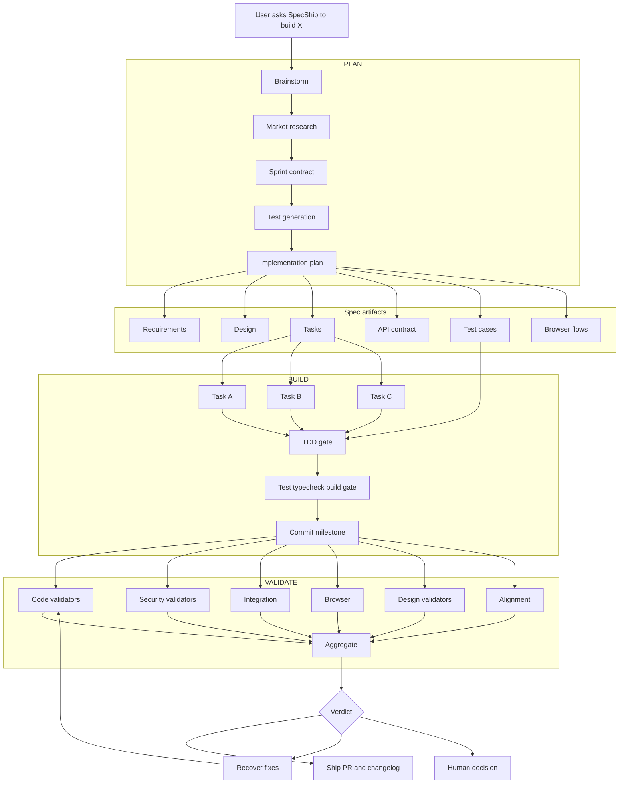

```mermaid
graph TD
    USER[User asks SpecShip to build X]

    subgraph PLAN[PLAN]
        B[Brainstorm]
        MR[Market research]
        SC[Sprint contract]
        TG[Test generation]
        IP[Implementation plan]
    end

    subgraph SPEC[Spec artifacts]
        S1[Requirements]
        S2[Design]
        S3[Tasks]
        A4[Test cases]
        A3[API contract]
        A6[Browser flows]
    end

    subgraph BUILD[BUILD]
        T1[Task A]
        T2[Task B]
        T3[Task C]
        TDD[TDD gate]
        TEST[Test typecheck build gate]
        COMMIT[Commit milestone]
    end

    subgraph VALIDATE[VALIDATE]
        V1[Code validators]
        V2[Security validators]
        V3[Integration]
        V4[Browser]
        V5[Design validators]
        V6[Alignment]
        AGG[Aggregate]
    end

    DECISION{Verdict}
    RECOVER[Recover fixes]
    SHIP[Ship PR and changelog]
    ESCALATE[Human decision]

    USER --> B
    B --> MR
    MR --> SC
    SC --> TG
    TG --> IP

    IP --> S1
    IP --> S2
    IP --> S3
    IP --> A3
    IP --> A4
    IP --> A6

    S3 --> T1
    S3 --> T2
    S3 --> T3
    A4 --> TDD
    T1 --> TDD
    T2 --> TDD
    T3 --> TDD
    TDD --> TEST
    TEST --> COMMIT

    COMMIT --> V1
    COMMIT --> V2
    COMMIT --> V3
    COMMIT --> V4
    COMMIT --> V5
    COMMIT --> V6
    V1 --> AGG
    V2 --> AGG
    V3 --> AGG
    V4 --> AGG
    V5 --> AGG
    V6 --> AGG

    AGG --> DECISION
    DECISION --> SHIP
    DECISION --> RECOVER
    DECISION --> ESCALATE
    RECOVER --> V1
```
